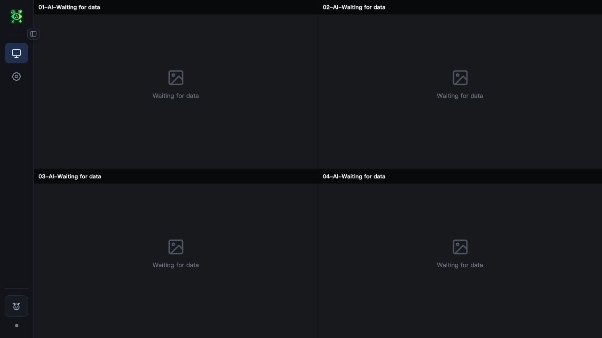
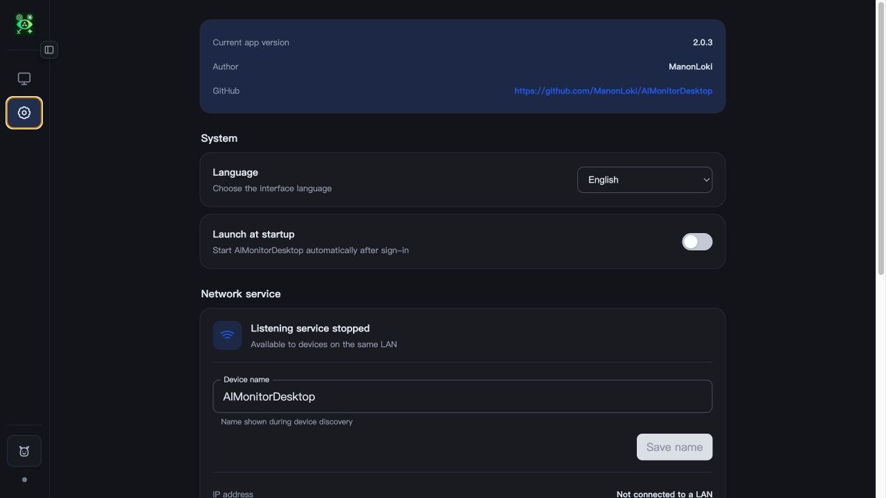
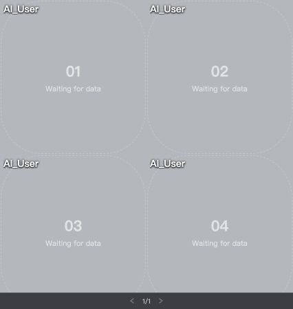

# AIMonitorDesktop

English | [简体中文](./Readme_zh.md)

A desktop monitoring client for displaying and managing AI task status across a
local network, developed by ManonLoki.

Current version: `2.0.4`. The current architecture is built around multiple
native windows, a Rust-owned shared runtime state, desktop pet mode, and a
bilingual English/Chinese interface.

The LAN HTTP API is currently v3. Slot updates must include the controller's
`clientId`. Controllers renew their leases every 30 seconds through
`POST /api/clients/{clientId}/heartbeat`; after two minutes without a heartbeat,
the desktop app clears only the slots owned by that controller.

## Screenshots

### Monitor dashboard



> The current 2 × 2 monitor grid. When data is available, a slot displays the
> character image, name, status, and last update time.

### Settings



> Switch the interface language, configure launch at login, device identity,
> grid dimensions, and image scaling, and inspect version and LAN service
> information.

### Desktop pet



> Desktop pet mode keeps monitored characters in a transparent, borderless
> window, with paginated layouts and quick mode switching.

## Desktop pet mode

Desktop pet mode is a lightweight presentation of the main dashboard. It reuses
the character images and Rust runtime state from the monitor slots without
changing the LAN API or its 25-slot protocol.

- The dashboard and desktop pet windows are mutually exclusive, and the last
  active mode is restored after switching or restarting.
- The supported layouts are `1×1`, `1×2`, `2×1`, `1×3`, `3×1`, and `2×2`.
  They display one to four AI characters at a time and paginate when needed.
- Use the mouse wheel to turn pages. Hold `Ctrl`/`Command` while scrolling to
  resize, or double-click a non-control area to return to the dashboard.
- Right-click to open a dedicated settings window centered on the desktop pet's
  current display. It controls the layout, continuous size, always-on-top
  behavior, and position lock.
- Every pet cell remains square. The pager floats above the canvas and appears
  only while the pointer is inside the window.
- Size represents the edge length of one cell, with a minimum of 32 px. Window
  dimensions are calculated from cell size and layout, and the longest edge is
  capped at one quarter of the display's logical shortest edge.
- Size limits adapt to the current display's work area and DPI, and are
  constrained automatically when the window moves between displays.
- Geometry is persisted separately for all six layouts. On macOS, the desktop
  pet remains visible when switching Spaces on the same display.
- On macOS, the app uses only its menu bar tray entry and does not add an extra
  Dock icon.
- The tray menu follows the active mode. Dashboard mode offers “Desktop pet
  mode / Show dashboard”; desktop pet mode offers “Dashboard mode / Lock
  desktop pet.” Both include “Launch at login / Quit.”

The complete interaction, window, persistence, and acceptance baseline is
documented in [Desktop Pet Mode Design](./docs/DESKTOP_PET_MODE_DESIGN.md)
(Chinese).

## Tech stack

- Desktop framework: Tauri 2
- Frontend: React 19 + TypeScript
- UI motion: React Bits + GSAP
- State control path: `@tauri-apps/api` (`invoke` / events); images are loaded
  from the built-in HTTP service through a loopback URL
- Build tool: Vite 8
- Package manager: pnpm, with exact dependency versions and a committed lockfile

The dashboard, settings page, desktop pet window, desktop pet settings window,
and tray menu support both English and Simplified Chinese. The language can
follow the operating system or be selected manually.

See [TECH_STACK.md](./TECH_STACK.md) (Chinese) for detailed technology
boundaries.

React Bits components are maintained as source under
`src/components/reactbits/` and have been adapted for desktop interaction and
the operating system's reduced-motion preference. See
[THIRD_PARTY_NOTICES.md](./THIRD_PARTY_NOTICES.md) for upstream notices.

## Requirements

- Node.js >= 22.12
- pnpm 10
- Stable Rust
- The platform prerequisites required by Tauri

## Development

```bash
pnpm install
pnpm run dev
```

Start the desktop application:

```bash
pnpm run tauri dev
```

## Release builds (maintainer guide)

Release handling is integrated into the Tauri build workflow. Separate manual
signing or notarization scripts are not required. A macOS package is copied into
`publish/` only after Developer ID signing, notarization, ticket stapling, and
Gatekeeper verification all succeed.

### One-time build machine setup

Install project dependencies and Rust targets:

```bash
pnpm install
rustup target add aarch64-apple-darwin x86_64-apple-darwin
rustup target add x86_64-pc-windows-msvc
```

The macOS keychain must contain a valid `Developer ID Application` certificate
and its private key. Check available signing identities with:

```bash
security find-identity -v -p codesigning
```

Cross-building Windows also requires `cargo-xwin`, NSIS, and LLVM:

```bash
brew install llvm nsis
cargo install --locked cargo-xwin
```

Create an App Store Connect API key with the Developer role, store the downloaded
`.p8` key in a secure local directory, and save the notarization credentials in
the keychain. Replace every angle-bracket placeholder with your own value:

```bash
mkdir -p "$HOME/.appstoreconnect/private_keys"
chmod 700 "$HOME/.appstoreconnect/private_keys"
chmod 600 "$HOME/.appstoreconnect/private_keys/AuthKey_<KEY_ID>.p8"

xcrun notarytool store-credentials AIMonitorNotary \
  --key "$HOME/.appstoreconnect/private_keys/AuthKey_<KEY_ID>.p8" \
  --key-id "<KEY_ID>" \
  --issuer "<ISSUER_ID>"
```

Verify the stored credentials:

```bash
xcrun notarytool history --keychain-profile AIMonitorNotary
```

Never commit certificates, certificate private keys, API keys, `.p8` files, or
the Issuer ID. If you use a different profile name, set
`AIMONITOR_NOTARY_PROFILE` before building. Tauri's `APPLE_API_KEY`,
`APPLE_API_ISSUER`, and `APPLE_API_KEY_PATH` environment variables are also
supported, but a keychain profile is recommended for routine releases so that
secrets do not appear in shell history or CI logs.

### Each release

1. Update the version in `package.json`, `src-tauri/Cargo.toml`,
   `src-tauri/Cargo.lock`, and `src-tauri/tauri.conf.json`. All version sources,
   including the root package entry in the Cargo lockfile, must match.
2. Run the complete pre-release checks:

   ```bash
   pnpm run check
   pnpm run build
   ```

3. Choose a release target:

   ```bash
   # Universal macOS build (Apple Silicon + Intel)
   pnpm run build:mac

   # Windows x64 via cargo-xwin on macOS/Linux
   pnpm run build:win

   # Build universal macOS, then Windows x64
   pnpm run build:release
   ```

   To build a single macOS architecture, override the default target:

   ```bash
   AIMONITOR_MAC_TARGET=aarch64-apple-darwin pnpm run build:mac
   AIMONITOR_MAC_TARGET=x86_64-apple-darwin pnpm run build:mac
   ```

4. Inspect `publish/` after a successful release. The script removes old
   artifacts only after all requested targets succeed and generates:

   - `AIMonitorDesktop-macOS-<architecture>-v<version>.dmg`
   - `AIMonitorDesktop-Windows-x64-v<version>-setup.exe`
   - `AIMonitorDesktop-SHA256SUMS.txt`

The automated macOS flow is: build and sign with Tauri → verify the signature →
submit to Apple and wait for `Accepted` → staple the notarization ticket → run
the Gatekeeper check → copy the result into `publish/`. Any failure stops the
release, so an unnotarized DMG is never presented as a release artifact.

The Windows installer currently uses `--no-sign` and therefore has no
Authenticode signature. This is independent of macOS Developer ID signing and
notarization.

### Post-release verification

Replace the placeholder with the actual DMG filename:

```bash
xcrun stapler validate "publish/AIMonitorDesktop-macOS-<architecture>-v<version>.dmg"
spctl --assess --verbose=2 --type open \
  --context context:primary-signature \
  "publish/AIMonitorDesktop-macOS-<architecture>-v<version>.dmg"
shasum -a 256 -c publish/AIMonitorDesktop-SHA256SUMS.txt
```

`stapler validate` should succeed. The `spctl` output should contain `accepted`
and `source=Notarized Developer ID`. As a final check, download the DMG onto
another Mac and test installation and first launch through the normal user flow.

### Moving to a new machine or rotating keys

A new machine needs both the Developer ID certificate with its private key and
the App Store Connect `.p8` private key. After importing the signing identity,
run `notarytool store-credentials` again on the new machine; do not copy a
keychain profile file. Once the new configuration is verified, revoke any old
API key that is no longer needed in App Store Connect.

### Troubleshooting

- Signing identity not found: make sure the certificate and matching private key
  are both in the keychain, then run
  `security find-identity -v -p codesigning`.
- `AIMonitorNotary` not found: run `notarytool store-credentials` again or set
  the correct `AIMONITOR_NOTARY_PROFILE`.
- Notarization returns `Invalid`: get the Submission ID from the build output,
  then run
  `xcrun notarytool log <SUBMISSION_ID> --keychain-profile AIMonitorNotary`.
- Windows build reports a missing command: verify that `cargo-xwin`,
  `makensis`, and `llvm-rc` are all on `PATH`.
- The DMG is signed but Gatekeeper still blocks it: do not bypass the security
  check for a release. Verify that `stapler validate` succeeds and `spctl`
  reports `Notarized Developer ID`, then redistribute the corrected artifact.
