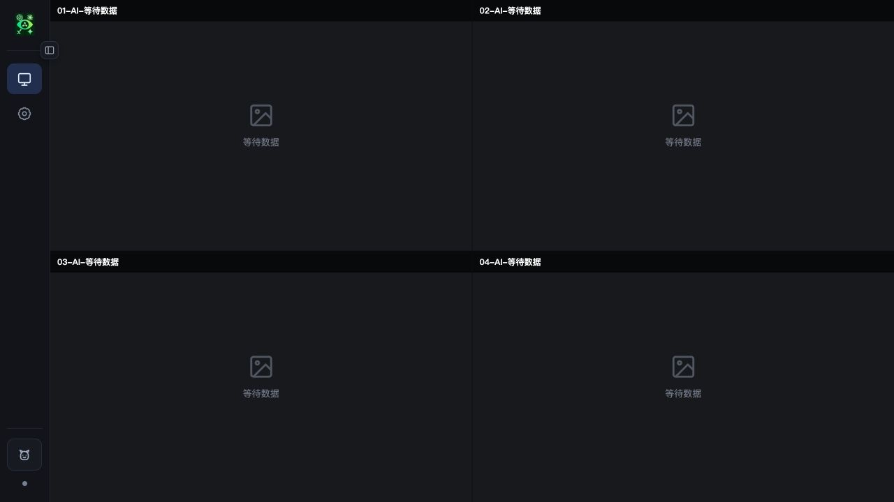
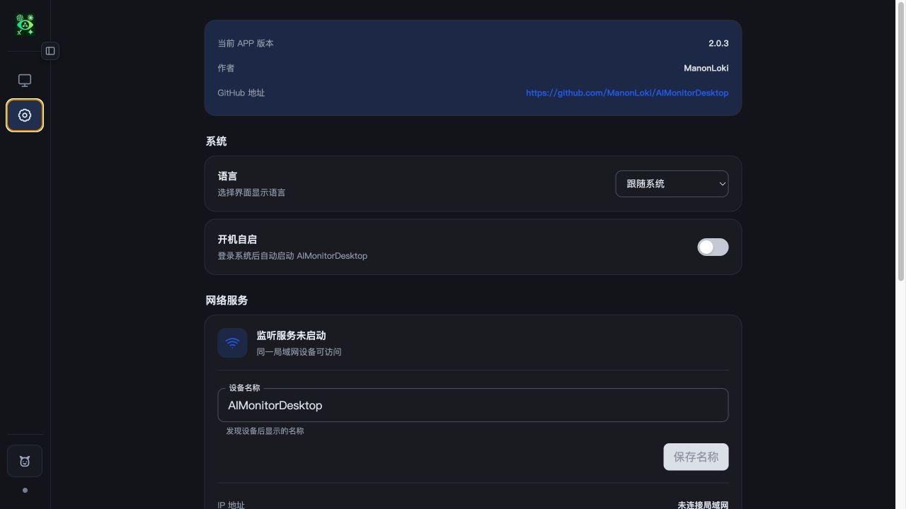
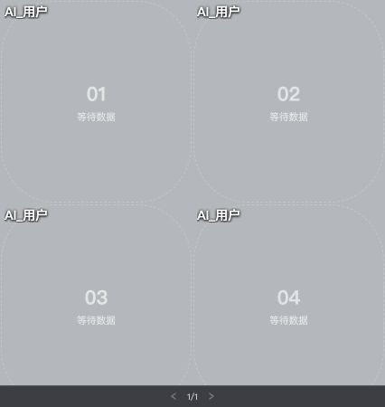

# AIMonitorDesktop

[English](./README.md) | 简体中文

AI 监控平台桌面版，由 ManonLoki 开发。

当前版本：`2.0.3`。本版本以多原生窗口、Rust 统一窗口状态、桌宠模式和中英文
界面为架构基线。

局域网 HTTP API 当前为 v3。槽位更新必须携带控制端 `clientId`，并通过
`POST /api/clients/{clientId}/heartbeat` 每 30 秒续租；连续 2 分钟未续租时，
桌面端只清理该控制端拥有的宫格。

## 界面截图

### 监控界面



> 当前 2 × 2 监控宫格。槽位有数据时会显示角色图片、名称、状态和更新时间。

### 设置界面



> 可切换中英文界面，并配置开机自启、设备名称、监控宫格和画布图片显示方式，
> 同时查看版本及局域网服务信息。

### 桌宠界面



> 桌宠模式将监控角色以透明、无边框窗口常驻桌面，并提供循环分页与快捷模式切换。

## 桌宠模式

桌宠模式是主监控界面的轻量桌面展示形态，直接复用监控槽位中的角色图片和
Rust 运行时状态，不改变局域网 API 或 25 个槽位的协议。

- 主界面与桌宠窗口互斥显示，切换或重启后恢复上次模式。
- 支持 `1×1`、`1×2`、`2×1`、`1×3`、`3×1` 和 `2×2` 布局，适配 1～4 个 AI 展示并循环分页。
- 普通滚轮翻页，`Ctrl/Command + 滚轮`缩放，双击非控制区域返回主界面。
- 右键打开独立桌宠设置窗口；窗口在桌宠当前所在显示器居中，可调整布局、连续
  尺寸、始终置顶和位置锁定。
- 每个桌宠单元保持正方形；底部分页条悬浮在画布上，仅在鼠标位于窗口内时显示。
- 尺寸统一表示单格边长，最小 32px；窗口按单格尺寸乘以行列数生成，长边最大为屏幕逻辑最短边的四分之一。
- 尺寸按当前显示器工作区与 DPI 动态限制，跨显示器时自动收敛到可操作范围。
- 六种桌宠布局分别持久化几何状态；macOS 切换同一显示器的桌面空间时桌宠保持可见。
- macOS 仅保留菜单栏托盘入口，不在 Dock 中显示额外图标。
- 托盘菜单随模式精简：看板模式依次提供“桌宠模式 / 显示看板”，桌宠模式依次
  提供“看板模式 / 锁定桌宠”；两种模式均保留“开机自启 / 退出”。

完整且与当前实现同步的交互、窗口、持久化与验收基线见
[桌宠模式设计](./docs/DESKTOP_PET_MODE_DESIGN.md)。

## 技术栈

- 桌面框架：Tauri 2
- 前端框架：React 19 + TypeScript
- UI 动效：React Bits + GSAP
- 状态控制通路：`@tauri-apps/api`（invoke / event）；图片内容通过内置 HTTP 服务的回环地址读取
- 构建工具：Vite 8
- 包管理器：pnpm（依赖使用精确版本并提交锁文件）

主界面、设置页、桌宠窗口、桌宠设置窗口和系统托盘菜单均支持简体中文与英文；
语言可跟随系统或手动指定。

具体选型边界见 [TECH_STACK.md](./TECH_STACK.md)。

React Bits 组件以可维护源码方式放在 `src/components/reactbits/`，并针对桌面端交互与系统“减少动态效果”偏好做了适配。上游许可见 [THIRD_PARTY_NOTICES.md](./THIRD_PARTY_NOTICES.md)。

## 环境要求

- Node.js >= 22.12
- pnpm 10
- Rust stable
- Tauri 对应平台依赖

## 开发

```bash
pnpm install
pnpm run dev
```

启动桌面应用：

```bash
pnpm run tauri dev
```

## 发布构建（维护者手册）

发布入口已经集成到 Tauri 构建流程中，不需要再手工运行独立的签名或公证脚本。
macOS 包只有在 Developer ID 签名、公证、票据装订和 Gatekeeper 校验全部通过后，
才会进入 `publish/`。

### 首次配置构建机

安装项目依赖和 Rust 目标：

```bash
pnpm install
rustup target add aarch64-apple-darwin x86_64-apple-darwin
rustup target add x86_64-pc-windows-msvc
```

macOS 钥匙串中必须安装有效的 `Developer ID Application` 证书及其私钥。可用
以下命令检查签名身份：

```bash
security find-identity -v -p codesigning
```

Windows 交叉构建还需要 `cargo-xwin`、NSIS 和 LLVM：

```bash
brew install llvm nsis
cargo install --locked cargo-xwin
```

创建 Developer 权限的 App Store Connect API Key，将下载的 `.p8` 私钥保存到
本机安全目录，再把公证凭据写入钥匙串。尖括号内容必须替换为自己的值：

```bash
mkdir -p "$HOME/.appstoreconnect/private_keys"
chmod 700 "$HOME/.appstoreconnect/private_keys"
chmod 600 "$HOME/.appstoreconnect/private_keys/AuthKey_<KEY_ID>.p8"

xcrun notarytool store-credentials AIMonitorNotary \
  --key "$HOME/.appstoreconnect/private_keys/AuthKey_<KEY_ID>.p8" \
  --key-id "<KEY_ID>" \
  --issuer "<ISSUER_ID>"
```

验证钥匙串凭据是否可用：

```bash
xcrun notarytool history --keychain-profile AIMonitorNotary
```

证书、证书私钥、API Key、`.p8` 文件和 Issuer ID 都不得提交到仓库。若使用了
其他 profile 名称，构建前设置 `AIMONITOR_NOTARY_PROFILE`。也可以使用 Tauri
支持的 `APPLE_API_KEY`、`APPLE_API_ISSUER` 和 `APPLE_API_KEY_PATH` 环境变量，
但日常发布推荐使用钥匙串 profile，避免密钥出现在终端历史或 CI 日志中。

### 每次发布

1. 同步修改 `package.json`、`src-tauri/Cargo.toml`、
   `src-tauri/Cargo.lock` 和 `src-tauri/tauri.conf.json` 中的版本号；三个版本源
   必须一致，Cargo 锁文件中的根包版本也必须同步。
2. 提交发布前先执行完整检查：

   ```bash
   pnpm run check
   pnpm run build
   ```

3. 根据目标选择一个发布命令：

   ```bash
   # macOS 通用架构（Apple Silicon + Intel）
   pnpm run build:mac

   # Windows x64（在 macOS/Linux 上使用 cargo-xwin）
   pnpm run build:win

   # 依次构建 macOS 通用架构和 Windows x64
   pnpm run build:release
   ```

   如只需单一 macOS 架构，可覆盖默认目标：

   ```bash
   AIMONITOR_MAC_TARGET=aarch64-apple-darwin pnpm run build:mac
   AIMONITOR_MAC_TARGET=x86_64-apple-darwin pnpm run build:mac
   ```

4. 发布成功后检查 `publish/`。脚本会在所有目标均成功后清理旧产物，并生成：

   - `AIMonitorDesktop-macOS-<架构>-v<版本>.dmg`
   - `AIMonitorDesktop-Windows-x64-v<版本>-setup.exe`
   - `AIMonitorDesktop-SHA256SUMS.txt`

macOS 自动流程为：Tauri 构建并签名 → 校验签名 → 提交 Apple 公证并等待
`Accepted` → staple 公证票据 → Gatekeeper 校验 → 复制到 `publish/`。任一步骤
失败都会终止发布，不会把未公证的 DMG 当作正式产物。

Windows 安装器目前使用 `--no-sign` 构建，因此没有 Authenticode 签名；这与
macOS 的 Developer ID 签名、公证是两套独立机制。

### 发布后验证

将下面的 DMG 文件名替换为本次实际产物：

```bash
xcrun stapler validate "publish/AIMonitorDesktop-macOS-<架构>-v<版本>.dmg"
spctl --assess --verbose=2 --type open \
  --context context:primary-signature \
  "publish/AIMonitorDesktop-macOS-<架构>-v<版本>.dmg"
shasum -a 256 -c publish/AIMonitorDesktop-SHA256SUMS.txt
```

`stapler validate` 应成功；`spctl` 输出应包含 `accepted` 和
`source=Notarized Developer ID`。最后建议把 DMG 下载到另一台 Mac，按真实用户
路径完成一次安装和首次启动测试。

### 更换电脑或轮换密钥

新电脑需要同时迁移两类凭据：Developer ID 证书及其私钥，以及 App Store
Connect `.p8` 私钥。导入签名证书后，在新电脑重新执行
`notarytool store-credentials`，不要复制钥匙串 profile 文件。确认新配置可用后，
再到 App Store Connect 撤销不再使用的旧 API Key。

### 常见问题

- 找不到签名身份：确认钥匙串内同时存在证书和对应私钥，再运行
  `security find-identity -v -p codesigning`。
- 找不到 `AIMonitorNotary`：重新执行 `notarytool store-credentials`，或设置正确的
  `AIMONITOR_NOTARY_PROFILE`。
- 公证返回 `Invalid`：从构建输出取得 Submission ID，然后执行
  `xcrun notarytool log <SUBMISSION_ID> --keychain-profile AIMonitorNotary` 查看原因。
- Windows 构建提示缺少命令：检查 `cargo-xwin`、`makensis`、`llvm-rc` 是否都在
  `PATH` 中。
- DMG 能签名但仍被 Gatekeeper 拦截：不要绕过安全检查发布；确认
  `stapler validate` 成功且 `spctl` 显示 `Notarized Developer ID` 后重新分发。
